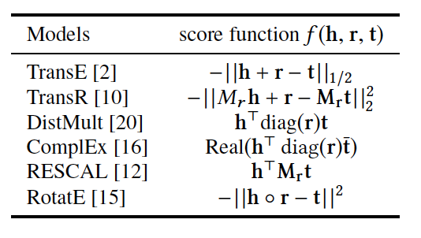

# Compare and Contrast different KGEs

- Knowledge graph embedding is the task of completing the knowledge graphs by probabilistically inferring the missing arcs from the existing graph structure

## Scores

- One difference is the score function (see dissimilarity function I think?)
- TransE
    - emb("PersonA") = h
    - emb("PersonB) = t
    - hopefully, h + r ~= t
    - represented via those triples 
    - Their relationship, is just a translation vector
    - scoring function is negative distance between h+r and t, or f=−∥h+r−t∥ sub 1/2
    - TODO FIND OUT WHAT TYPES of relation this can stores
        - then what it does well/not so well

- TransH
    - Hyperplane?
    - 
- TransR
    - Can only cover 1-to-1
    - to solve that, it separates entity space, from relationship space
    - h, t are elements of R^k
    - r is an element of R^d
        - d =  num entities
        - k =  num relations
    - those semantic spaces no longer need to be of the same dimension
    - projection matrix for each relation??